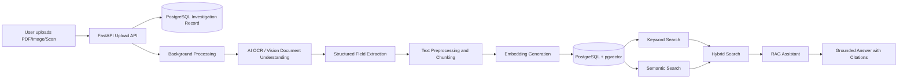

# Architecture

## High-level workflow

## Components

### Backend API

FastAPI exposes endpoints for upload, investigation management, OCR status, search, related reports, and assistant queries.

### Background processing

The upload endpoint returns quickly. OCR, structured extraction, chunking, and embedding run in a background task. The database stores separate statuses for upload, OCR, embeddings, and overall processing.

### AI OCR

PDF pages are rendered into images. Images are sent to a multimodal AI model for document understanding. The model returns extracted text, confidence, handwriting flag, warnings, and structured medical investigation fields.

### Embedding pipeline

Extracted text is normalized, chunked with overlap, embedded, and stored in pgvector.

### Retrieval

The system supports three retrieval modes:

1. Keyword search using PostgreSQL full-text search.
2. Semantic search using embedding cosine distance.
3. Hybrid search combining keyword relevance and semantic similarity.

### RAG assistant

The assistant receives only retrieved chunks as context. It must answer from that context and cite sources. If the evidence does not support the answer, it returns: `No supporting evidence found.`
